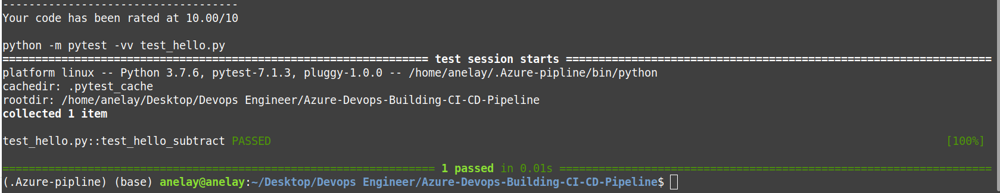
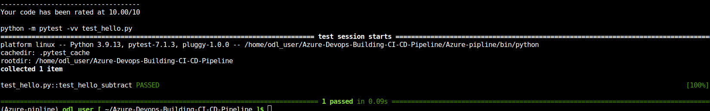
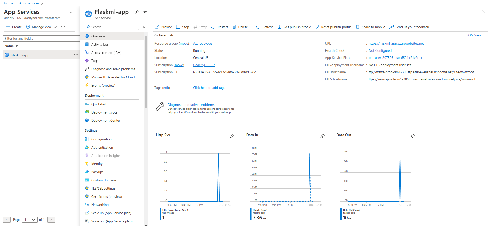
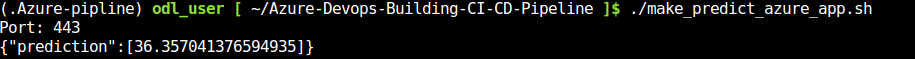
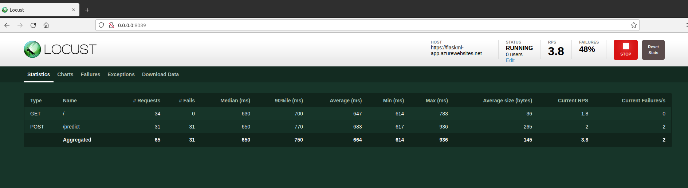
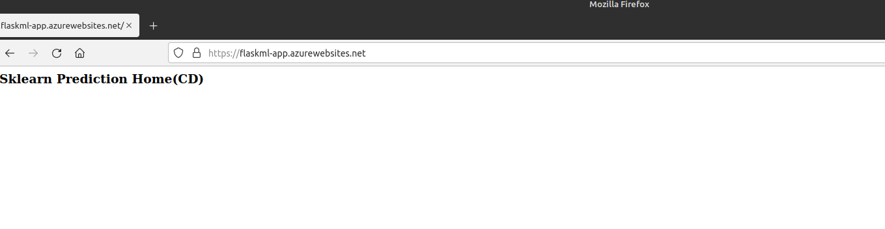
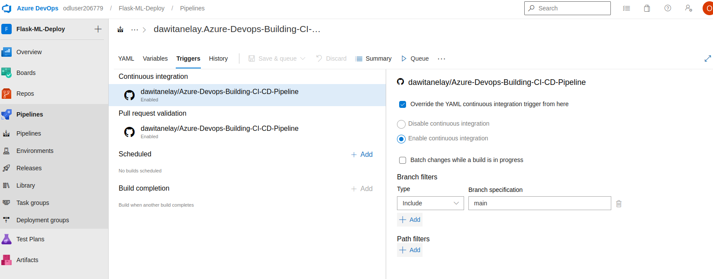
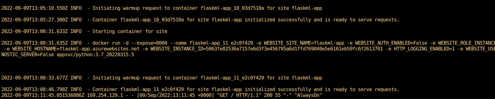

[](https://github.com/dawitanelay/Azure-Devops-Building-CI-CD-Pipeline/actions/workflows/main.yml)
# Azure-Devops-Building-CI-CD-Pipeline


## Introduction
Continuous Integration(CI) and Continuous Delivery(CD) are two of the five practices that we consider to be at the heart of DevOps.
CI is about Integrating our code in to a source control system so we can get fast feedback on its development where as  CD is about making sure that
every change to our code is ready for release as soon as possible 

In this project, I  build a Github repository from scratch and create a scaffolding that  assist  in performing both CI and CD. I use Github Actions along with a Makefile, requirements.txt and application code to perform an initial lint, test, and install cycle. Next, I integrate this project with [Azure Pipelines](https://azure.microsoft.com/en-us/services/devops/pipelines/) to enable Continuous Delivery to [Azure App Service](https://azure.microsoft.com/en-us/services/app-service/)
## Project Plan
I've included a quarterly and yearly plan in this [spreadsheet](https://docs.google.com/spreadsheets/d/1mVYLtcZ6-ncupYgM3m-HbbmeYRWQXq58leF58VNuDiM/edit#gid=0). There is also an estimated week by week deliverables with a time of difficulty for each task.
## Trello Board
Project management [Trello Board](https://trello.com/b/OIFZz5HW/azure-devops) 
## Architectural Diagram

## CI: Set Up Azure Cloud Shell
   * Create a [Github](https://github.com/) repository
   * Launch an Azure Cloud Shell environment and create ssh-keys. Upload these keys to your GitHub account
   
 
  
 
 * type  ` cat /home/odl_user/.ssh/id_ed25519.pub ` 
 * Copy the generated public key and go to GitHub. Click the settings and paste the key.
  
  * Make a git clone 
 
  ## Create Project Scaffolding
  Now that the environment is ready, we can build the scaffolding for our project and test our code.
  ### Create the Makefile
 ```makefile
install:
    pip install --upgrade pip &&\
        pip install -r requirements.txt

test:
    python -m pytest -vv test_hello.py

lint:
    pylint --disable=R,C hello.py

all: install lint test
```
  ### Create requirements.txt

Create a file named requirements.txt. A requirements.txt is a convenient way to list what packages a project needs. 

```
Flask==2.0.3
pandas
scikit-learn
pylint
pytest
joblib
locust
```


### Create the Python Virtual Environment
```
python3 -m venv ~/.Azure-pipline
source ~/.Azure-pipline/bin/activate
```
 ### Create the script file and test file.

The next step is to create the script file and test file. This is a boilerplate code to get the initial continuous integration process working. It will later be replaced by the real application code.

First, you will need to create [hello.py](http://hello.py/) with the following code at the top level of your Github repo:

```python
def toyou(x):
    return "hi %s" % x

def add(x):
    return x + 1

def subtract(x):
    return x - 1
```

Next, you will need to create test_hello.py with the following code at the top level of your Github repo:

```python
from hello import toyou, add, subtract

def setup_function(function):
    print("Running Setup: %s" % function.__name__)
    function.x = 10

def teardown_function(function):
    print("Running Teardown: %s" % function.__name__)
    del function.x

### Run to see failed test
#def test_hello_add():
#    assert add(test_hello_add.x) == 12

def test_hello_subtract():
    assert subtract(test_hello_subtract.x) == 9
 ```  
 ## Local Test  

Now it is time to run make all which will install, lint, and test code. This enables us to ensure we don't check in broken code to GitHub as it installs, lints, and tests the code in one command. Later we will have a remote build server perform the same step.


Run Python web application and you will see Sklearn Prediction Home in your browser

```python
Python app.py
```


## CI: Configure GitHub Actions
### Replace yml code
```
name: Python application test with Github Actions

on: [push]

jobs:
  build:

    runs-on: ubuntu-latest

    steps:
    - uses: actions/checkout@v2
    - name: Set up Python 3.6.15
      uses: actions/setup-python@v1
      with:
        python-version: 3.6.15
    - name: Install dependencies
      run: |
        make install
    - name: Lint with pylint
      run: |
        make lint
    - name: Test with pytest
      run: |
        make test
```
* Successful Github Action build Result

## Continuous Delivery on Azure
### Create Azure App Service
Similar to our localhost, Azure App Service is hosted in Azure.  We don't need to set up and maintain the virtual machines because the Azure APP service is PaaS. Use Azure Cloud Shell and run the command 
```
az webapp up --name <Your_unique_app_name> --resource-group Azuredevops
```

*

Edit file `make_predict_azure_app.sh` and replace `<yourappname>` with your webapp name
* Successful prediction


### Load Test
 Run ``` locust``` 
 
 
## Continuous Deployment with Azure Pipelines
We want to deploy our flask ML web application using Azure pipelines. To do this, we must first establish a service connection for Azure App Service and Azure Pipelines, and then create an Azure DevOps Project.

If you wish to use  self-hosted Azure pipeline agent (a new Linux VM) that will build and deploy the code. Here are the steps to create an Azure pipeline agent. Here is the tutorial you can follow along. [Azure pipeline agent](https://github.com/dawitanelay/Azure-Devops-Building-CI-CD-Pipeline/blob/aa7ac4b8b6053b2aa1bf9788b6945877473d85b7/Azure%20Pipeline%20Agent.pdf)

else 

[Use CI/CD to deploy a Python web app to Azure App Service on Linux](https://docs.microsoft.com/en-us/azure/devops/pipelines/ecosystems/python-webapp?view=azure-devops&WT.mc_id=udacity_learn-wwl)

After that, the Flask ML Web Application is deployed successful with Azure Pipelines.

Browse
```
https://flaskml-app.azurewebsites.net/
```
* You will see Sklearn Prediction Home(Continuous Delivery) in your browser


dawit
## Enable GitHub and Azure Pipelines
We want to ensure that when we make any changes to our GitHub repository, the Azure Pipelines will be activated since we have already set up the Azure Pipelines and deployed the Flask ML application on Azure. The applications will automatically deploy to Azure App Service while the pipelines are running.

I changed the title of my web application. When I commit the changes to GitHub, the Azure Pipleines are triggered, and my new changes are deployed to the App Service.
```
html = "<h3>Sklearn Prediction Home(Continuous Delivery )</h3>"
```
When I make changes to my branch, I tell the Azure Pipeline to deploy the web applications. as follow 
*
## Logs
```
az webapp log tail
```

## Enhancements
* Containerize the app using  docker
* Use k8s for managing containerized workloads and services
## Demo
https://www.youtube.com/watch?v=mvTztG6eduY
https://www.youtube.com/watch?v=MuetJ-bUGI8
